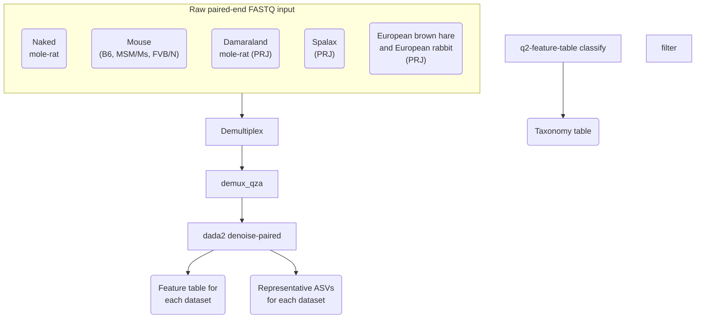

# Whole metagenome sequencing and metagenome assembly of the naked mole-rat gut microbiota
Version: 2025-07-10

# TODO: Add environment yaml
envs/ 
    qc.yml
    kraken2.yml
    mag.yml
# Add R sessionInfo
# Add markdowns and final report
# Add workflow (below)
# Add expected directory structure:
project/
    data/
        fastq
        metadata
    results
    logs


## Getting started
```sh
git clone https://github.com/amir-rakhimov/metagenome.git

# Create a conda environment for QC and decontamination
conda config --add channels defaults
conda config --add channels bioconda
conda config --add channels conda-forge
conda create -y --name qc-tools -c bioconda bowtie2 cutadapt samtools trf fastqc \
    multiqc seqtk bbmap blast csvtk htseq
wget https://github.com/broadinstitute/picard/releases/download/3.4.0/picard.jar \
    -O ~/picard.jar

# Or use the YAML file
conda env create -n qc-tools --file $HOME/qc-tools-linux-conda.yml

# Create a conda environment for Kraken2
conda config --add channels defaults
conda config --add channels bioconda
conda config --add channels conda-forge
# conda create -yqn kraken2-tools-2.1.3 -c conda-forge -c bioconda kraken2 krakentools bracken krona bowtie2
conda create -yqn kraken2-tools-2.1.6 -c conda-forge -c bioconda kraken2 krakentools bracken krona bowtie2
# Or use the YAML file
mamba env create -n kraken2-tools-2.1.6 --file $HOME/kraken2-tools-2.1.6-linux-conda.yml

# Create a conda environment for MAG assembly
mamba create -yqn mag_assembly-tools -c conda-forge -c bioconda \
     megahit prodigal checkm2 gtdbtk metaeuk \
    pandas bbmap augustus sepp hmmer biopython r-base r-ggplot2 \
    matplotlib prokka drep mmseqs2 coverm comparem anaconda::libtiff

# Build MetaBAT locally
# Install openssl first. Then, install metabat2
cd ~
wget https://bitbucket.org/berkeleylab/metabat/get/master.tar.gz
mv master.tar.gz metabat2_master.tar.gz
tar xzvf master.tar.gz
cd berkeleylab-metabat-*
mkdir build && cd build 
cmake \
  -DCMAKE_INSTALL_PREFIX=$HOME/berkeleylab-metabat-a51200652a89 \
  -DBoost_NO_SYSTEM_PATHS=ON \
  -DBoost_INCLUDE_DIR=$HOME/boost_1_88_0/include \
  -DBoost_LIBRARY_DIR=$HOME/boost_1_88_0/lib \
  -DBoost_PROGRAM_OPTIONS_LIBRARY_RELEASE=$HOME/boost_1_88_0/lib/libboost_program_options.so \
  -DBoost_GRAPH_LIBRARY_RELEASE=$HOME/boost_1_88_0/lib/libboost_graph.so \
  -DBoost_IOSTREAMS_LIBRARY_RELEASE=$HOME/boost_1_88_0/lib/libboost_iostreams.so \
  -DBoost_DEBUG=ON \
  ..

make
make test 
make install

conda activate mag_assembly-tools
cd ~/projects/metagenome
# Dowload GTDB-TK reference database
export GTDBTK_DATA_PATH=~/miniconda3/envs/mag_assembly-tools/share/gtdbtk-2.4.0/db/release226
download-db.sh

# Install QUAST
wget https://github.com/ablab/quast/releases/download/quast_5.2.0/quast-5.2.0.tar.gz -O ~/quast-5.2.0.tar.gz
tar -xzf ~/quast-5.2.0.tar.gz -C ~/

# For CheckM2
conda activate mag_assembly-tools
wget https://ani.jgi.doe.gov/download_files/ANIcalculator_v1.tgz -O ~/ANIcalculator_v1.tgz
tar -xzf ~/ANIcalculator_v1.tgz -C ~/
export PATH="/home/rakhimov/ANIcalculator_v1/ANIcalculator:$PATH" 
conda deactivate 

# Get KofamScan
mkdir -p ~/kofamscan/db
cd ~/kofamscan/db
wget ftp://ftp.genome.jp/pub/db/kofam/ko_list.gz 
wget ftp://ftp.genome.jp/pub/db/kofam/profiles.tar.gz 
gunzip ko_list.gz 
tar xvzf profiles.tar.gz 
mkdir -p ~/kofamscan/bin
cd ~/kofamscan/bin
wget ftp://ftp.genome.jp/pub/tools/kofam_scan/kofam_scan-1.3.0.tar.gz
tar xvzf kofam_scan-1.3.0.tar.gz

# Get HMMer for KofamScan
cd ~/kofamscan 
mkdir hmmer src 
cd src 
wget http://eddylab.org/software/hmmer/hmmer.tar.gz 
tar xvzf hmmer.tar.gz 
cd hmmer-3.4
./configure --prefix=$HOME/kofamscan/hmmer 
make 
make install 

# Get ruby
cd ~/kofamscan
mkdir ruby
cd src
wget https://cache.ruby-lang.org/pub/ruby/3.4/ruby-3.4.4.tar.gz
cd ~/kofamscan/src 
tar xvzf ruby-3.4.4.tar.gz
cd ruby-3.4.4
./configure --prefix=$HOME/kofamscan/ruby 
make 
make install 
export PATH=$HOME/kofamscan/ruby/bin:$PATH 

# Create a config.yml
cd ~/kofamscan/bin/kofam_scan-1.3.0
cp config-template.yml config.yml
echo "profile: /home/rakhimov/kofamscan/db/profiles " >> config.yml
echo "ko_list: /home/rakhimov/kofamscan/db/ko_list " >> config.yml 
echo "hmmsearch: /home/rakhimov/kofamscan/hmmer/bin/hmmsearch  " >> config.yml 
echo "parallel: /usr/bin/parallel" >> config.yml 

# Get the envrionment packages
conda env export mag_assembly-tools >  mag_assembly-tools-env.yaml

# Metagenomic thermometer
mamba create -yqn meta-thermo-env -c conda-forge -c bioconda \
    fastp seqkit prodigal python=3.6.5 numpy=1.19.0

# dbcan
conda create --name dbcan-tools -c conda-forge -c bioconda python=3.8 dbcan 

mamba env create -yqn checkm2-env -f code/bash-scripts/checkm2.yml
wget https://github.com/chklovski/CheckM2/archive/refs/heads/main.zip \
    -O ~/checkm2-main.zip

unzip ~/checkm2-main.zip -d ~/
conda activate checkm2-env
cd ~/CheckM2-main/
python setup.py install
# Download CheckM2 database
#checkm2 database --download --path ~/projects/metagenome/data/checkm2_db/

wget https://zenodo.org/records/14897628/files/checkm2_database.tar.gz \
    -O ~/projects/metagenome/data/checkm2_db/CheckM2_database/checkm2_database.tar.gz
tar -xvf ~/projects/metagenome/data/checkm2_db/CheckM2_database/checkm2_database.tar.gz \
    -C data/checkm2_db/CheckM2_database/

# Run QC and decontamination
bash run-qc-pipeline.sh

# Run the Kraken2 pipeline
bash run-kraken2-pipeline.sh

# Run the MAG assembly pipeline
bash run-mag-pipeline.sh

## Create symlink for latest results
Rscript run-analysis.R
```


## Description  
In this project, we analysed the whole metagenome sequencing data 
from naked mole-rats (Heterocephalus glaber).

This repo contains code and metadata necessary to produce the output and figures from
the original publication. We start from raw FASTQ files and finish with taxonomic 
classification, assembled contigs and bins, and functional annotation.

This is the second part of the metagenome project. The first 
part can be accessed here: https://github.com/amir-rakhimov/amplicon_nmr/

Data was obtained from Kumamoto University (n = 11). 

## Installation
1. qc-tools-env.yaml  
2. kraken2-tools-env.yaml  
3. mag_assembly-tools-env.yaml  

Statistical analysis in R requires the following R and Bioconductor packages: 
* tidyverse
* ggrepel
* ggtext
* Polychrome
* phyloseq
* qiime2R
* vegan v2.6-4
* ALDEx2
* ANCOMBC
* Maaslin2

### Tested on:
- Ubuntu 22.04  


## Input 
## Raw sequencing data:
Naked mole-rat samples generated in this study: PRJNA1405902

## Metadata
Naked mole-rat metadata: `metadata/yasuda/filenames-paired.tsv`

# Usage

## Whole metagenome sequencing analysis with Kraken2
FASTQ
  ↓
QC
  ↓
Host decontamination
  ↓
Kraken2
  ↓
Bracken
  ↓
Krona
## Metagenome assembly


## Key analysis steps
- Quality check and decontamination of whole metagenome sequencing reads
- Taxonomic classification of reads with Kraken2 and Bracken
- Differential abundance analysis to compare young and old naked mole-rats
- Assembly of reads into contiguous sequences (contigs) and metagenome-assembled genomes (MAGs)
- Prediction of genes based on contigs
- Annotation of predicted genes with dbCAN3 and KofamScan


## Publications
Original publication: Diversity and stability of the gut microbiome of naked mole-rat 
(Heterocephalus glaber), the longest-lived rodent  
Amir Rakhimov, Noriko Yasuda-Yoshihara, Masanori Arita, Kazuhiro Okumura, Yoshimi Kawamura, 
Kaori Oka, Hiroshi Mori, Yuichi Wakabayashi, Yoshifumi Baba, Hideo Baba, Kyoko Miura  
bioRxiv 2026.02.16.704739; doi: https://doi.org/10.64898/2026.02.16.704739

Zenodo data: Rakhimov, A., Yasuda, N., Arita, M., & Miura, K. (2026). 
The metagenome of the naked mole-rat [Data set]. Zenodo. https://doi.org/10.5281/zenodo.18454971


# BASH scripts, input, and output
| Script | Pipeline step | Input | Output |
|:--------|------:|------:|--------:|
| 001-qc-commands-with-bowtie2.sh       | Quality check and decontamination   | Raw paired-end demultiplexed FASTQ files, adapter sequences | MultiQC reports, decontaminated FASTQ files |
| 001-kraken2-build.sh       | Build Kraken2 reference database and Bracken index  | NCBI taxonomy, genomes   | Kraken2 DB |
| 002-kraken2-pipeline.sh      | Classify reads and estimate abundance of taxa  | Decontaminated reads   | Kraken2 reports, Bracken abundances, TXT files for Krona |
| 001-megahit-pipeline.sh |  Assemble reads into contigs and generate BAM files by mapping reads to contigs    | Decontaminated reads | FASTA file with contigs (each sample has its own directory), BAM files with mapping information |
| 002-metabat2-pipeline.sh |  Bins contigs into MAGs    | d | df |
| 003-mag-qc.sh |  d    | d | d |
| 004-taxonomic-classification.sh |    d  | d | d |
| 005-genome-annotation.sh |  d    | d | d |
| 006-quantify-genes.sh |  d    | d | d |
| 007-mag-stats.sh |  d    | d | d |
| 008-blast-contigs.sh |  d    | d | d |
| 009-search-cazymes-blast.sh |  d    | d | d |
| 010-meta-thermo-script.sh |  d    | d | d |


- `bash-scripts/qc-pipeline/001-qc-commands-with-bowtie2.sh`   
removes reads from
naked mole-rat, human, mouse, and Damaraland mole-rat genomes 
(because the lab works with these organisms).

# Statistical analysis and visualisation in R

# 2. Kraken2 pipeline
- `r-scripts/001-kraken2-classification-stats.R`  
Summarises


# 3. MAG assembly pipeline
Seqkit stats (MEGAHIT)
output/mag_assembly/seqkit_output/20250712_18_07_37_megahit_combined_stats.tsv

Seqkit stats (MetaBAT2)
output/mag_assembly/seqkit_output/20250712_18_07_37_metabat2_combined_stats.tsv

Seqkit stats (dRep)
output/mag_assembly/seqkit_output/20250712_18_07_37_sa_95perc_combined_stats.tsv

GTDB-tk results (species)
output/mag_assembly/gtdbtk_output/20250705_19_24_02_sa_95perc_classification_combined.tsv

BLASTN results (on contigs)
output/mag_assembly/blastn_output/20250701_05_24_10/20250701_05_24_10_blastn_all_samples.tsv

CoverM (MEGAHIT)
TODO

CoverM (dRep)
TODO

PROKKA sample-contig-gene mapping
output/mag_assembly/prokka_gtf_files/20250626_22_11_43_all_contig_gene_maps.tsv

HTseq gene counts from PROKKA (not normalised)
output/mag_assembly/htseq_gene_count/20250710_19_36_58_all_prokka_counts.tsv

MMseqs clusters (mapping between all proteins and representative sequences)
output/mag_assembly/mmseqs_output/easy_cluster/20250626_22_11_43/20250626_22_11_43_prokka_nr_prot_cluster.tsv

dbCAN results (on MMseqs proteins)
output/mag_assembly/dbcan_output/20250626_22_11_43_nr_dbcan_proteins/20250626_22_11_43_nr_dbcan_overview.txt


---


