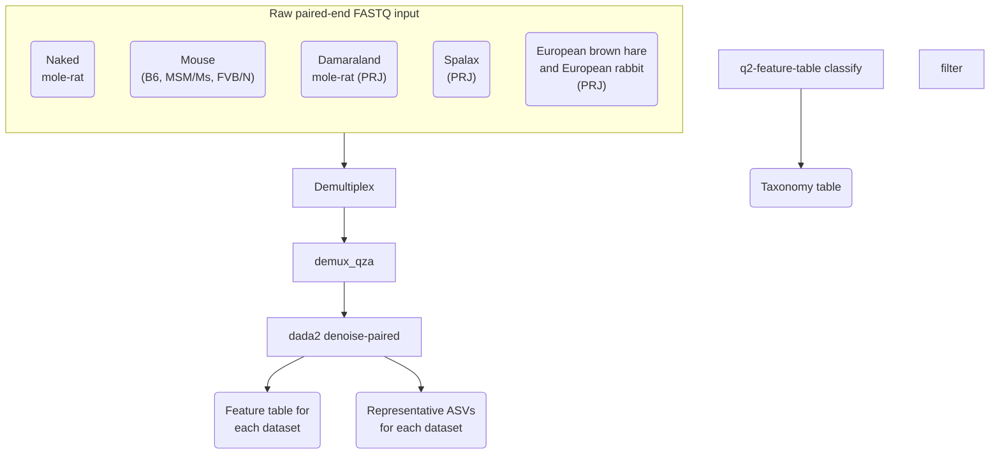

# Whole metagenome sequencing and metagenome assembly of the naked mole-rat gut microbiota
Version: 2025-07-10

# TODO: Add environment yaml
envs/ 
    qc.yml
    kraken2.yml
    mag.yml
# Add R sessionInfo
# Add markdowns and final report
# Add workflow (below)
# Add expected directory structure:
project/
    data/
        fastq
        metadata
    results
    logs


## Getting started
```sh
git clone https://github.com/amir-rakhimov/metagenome.git

# Create a conda environment for QC and decontamination
conda config --add channels defaults
conda config --add channels bioconda
conda config --add channels conda-forge
conda create -y --name qc-tools -c bioconda bowtie2 cutadapt samtools trf fastqc \
    multiqc seqtk bbmap blast csvtk htseq
wget https://github.com/broadinstitute/picard/releases/download/3.4.0/picard.jar \
    -O ~/picard.jar

# Or use the YAML file
conda env create -n qc-tools --file $HOME/qc-tools-linux-conda.yml

# Create a conda environment for Kraken2
conda config --add channels defaults
conda config --add channels bioconda
conda config --add channels conda-forge
# conda create -yqn kraken2-tools-2.1.3 -c conda-forge -c bioconda kraken2 krakentools bracken krona bowtie2
conda create -yqn kraken2-tools-2.1.6 -c conda-forge -c bioconda kraken2 krakentools bracken krona bowtie2
# Or use the YAML file
mamba env create -n kraken2-tools-2.1.6 --file $HOME/kraken2-tools-2.1.6-linux-conda.yml

# Create a conda environment for MAG assembly
mamba create -yqn mag_assembly-tools -c conda-forge -c bioconda \
     megahit prodigal checkm2 gtdbtk metaeuk \
    pandas bbmap augustus sepp hmmer biopython r-base r-ggplot2 \
    matplotlib prokka drep mmseqs2 coverm comparem anaconda::libtiff

# Build MetaBAT locally
# Install openssl first. Then, install metabat2
cd ~
wget https://bitbucket.org/berkeleylab/metabat/get/master.tar.gz
mv master.tar.gz metabat2_master.tar.gz
tar xzvf master.tar.gz
cd berkeleylab-metabat-*
mkdir build && cd build 
cmake \
  -DCMAKE_INSTALL_PREFIX=$HOME/berkeleylab-metabat-a51200652a89 \
  -DBoost_NO_SYSTEM_PATHS=ON \
  -DBoost_INCLUDE_DIR=$HOME/boost_1_88_0/include \
  -DBoost_LIBRARY_DIR=$HOME/boost_1_88_0/lib \
  -DBoost_PROGRAM_OPTIONS_LIBRARY_RELEASE=$HOME/boost_1_88_0/lib/libboost_program_options.so \
  -DBoost_GRAPH_LIBRARY_RELEASE=$HOME/boost_1_88_0/lib/libboost_graph.so \
  -DBoost_IOSTREAMS_LIBRARY_RELEASE=$HOME/boost_1_88_0/lib/libboost_iostreams.so \
  -DBoost_DEBUG=ON \
  ..

make
make test 
make install

conda activate mag_assembly-tools
cd ~/projects/metagenome
# Dowload GTDB-TK reference database
export GTDBTK_DATA_PATH=~/miniconda3/envs/mag_assembly-tools/share/gtdbtk-2.4.0/db/release226
download-db.sh

# Install QUAST
wget https://github.com/ablab/quast/releases/download/quast_5.2.0/quast-5.2.0.tar.gz -O ~/quast-5.2.0.tar.gz
tar -xzf ~/quast-5.2.0.tar.gz -C ~/

# For CheckM2
conda activate mag_assembly-tools
wget https://ani.jgi.doe.gov/download_files/ANIcalculator_v1.tgz -O ~/ANIcalculator_v1.tgz
tar -xzf ~/ANIcalculator_v1.tgz -C ~/
export PATH="/home/rakhimov/ANIcalculator_v1/ANIcalculator:$PATH" 
conda deactivate 

# Get KofamScan
mkdir -p ~/kofamscan/db
cd ~/kofamscan/db
wget ftp://ftp.genome.jp/pub/db/kofam/ko_list.gz 
wget ftp://ftp.genome.jp/pub/db/kofam/profiles.tar.gz 
gunzip ko_list.gz 
tar xvzf profiles.tar.gz 
mkdir -p ~/kofamscan/bin
cd ~/kofamscan/bin
wget ftp://ftp.genome.jp/pub/tools/kofam_scan/kofam_scan-1.3.0.tar.gz
tar xvzf kofam_scan-1.3.0.tar.gz

# Get HMMer for KofamScan
cd ~/kofamscan 
mkdir hmmer src 
cd src 
wget http://eddylab.org/software/hmmer/hmmer.tar.gz 
tar xvzf hmmer.tar.gz 
cd hmmer-3.4
./configure --prefix=$HOME/kofamscan/hmmer 
make 
make install 

# Get ruby
cd ~/kofamscan
mkdir ruby
cd src
wget https://cache.ruby-lang.org/pub/ruby/3.4/ruby-3.4.4.tar.gz
cd ~/kofamscan/src 
tar xvzf ruby-3.4.4.tar.gz
cd ruby-3.4.4
./configure --prefix=$HOME/kofamscan/ruby 
make 
make install 
export PATH=$HOME/kofamscan/ruby/bin:$PATH 

# Create a config.yml
cd ~/kofamscan/bin/kofam_scan-1.3.0
cp config-template.yml config.yml
echo "profile: /home/rakhimov/kofamscan/db/profiles " >> config.yml
echo "ko_list: /home/rakhimov/kofamscan/db/ko_list " >> config.yml 
echo "hmmsearch: /home/rakhimov/kofamscan/hmmer/bin/hmmsearch  " >> config.yml 
echo "parallel: /usr/bin/parallel" >> config.yml 

# Get the envrionment packages
conda env export mag_assembly-tools >  mag_assembly-tools-env.yaml

# Metagenomic thermometer
mamba create -yqn meta-thermo-env -c conda-forge -c bioconda \
    fastp seqkit prodigal python=3.6.5 numpy=1.19.0


# Run QC and decontamination
bash run-qc-pipeline.sh

# Run the Kraken2 pipeline
bash run-kraken2-pipeline.sh

# Run the MAG assembly pipeline
bash run-mag-pipeline.sh

## Create symlink for latest results
Rscript run-analysis.R
```


## Description  
In this project, we analysed the whole metagenome sequencing data 
from naked mole-rats (Heterocephalus glaber).

This repo contains code and metadata necessary to produce the output and figures from
the original publication. We start from raw FASTQ files and finish with taxonomic 
classification, assembled contigs and bins, and functional annotation.

This is the second part of the metagenome project. The first 
part can be accessed here: https://github.com/amir-rakhimov/amplicon_nmr/

Data was obtained from Kumamoto University (n = 11). 

## Installation
1. qc-tools-env.yaml  
2. kraken2-tools-env.yaml  
3. mag_assembly-tools-env.yaml  

Statistical analysis in R requires the following R and Bioconductor packages: 
* tidyverse
* ggrepel
* ggtext
* Polychrome
* phyloseq
* qiime2R
* vegan v2.6-4
* ALDEx2
* ANCOMBC
* Maaslin2

### Tested on:
- Ubuntu 22.04  


## Input 
## Raw sequencing data:
Naked mole-rat samples generated in this study: PRJNA1405902

## Metadata
Naked mole-rat metadata: `metadata/yasuda/filenames-paired.tsv`

# Usage

## Whole metagenome sequencing analysis with Kraken2
FASTQ
  ↓
QC
  ↓
Host decontamination
  ↓
Kraken2
  ↓
Bracken
  ↓
Krona
## Metagenome assembly


## Key analysis steps
- Quality check and decontamination of whole metagenome sequencing reads
- Taxonomic classification of reads with Kraken2 and Bracken
- Differential abundance analysis to compare young and old naked mole-rats
- Assembly of reads into contiguous sequences (contigs) and metagenome-assembled genomes (MAGs)
- Prediction of genes based on contigs
- Annotation of predicted genes with dbCAN3 and KofamScan


## Publications
Original publication: Diversity and stability of the gut microbiome of naked mole-rat 
(Heterocephalus glaber), the longest-lived rodent  
Amir Rakhimov, Noriko Yasuda-Yoshihara, Masanori Arita, Kazuhiro Okumura, Yoshimi Kawamura, 
Kaori Oka, Hiroshi Mori, Yuichi Wakabayashi, Yoshifumi Baba, Hideo Baba, Kyoko Miura  
bioRxiv 2026.02.16.704739; doi: https://doi.org/10.64898/2026.02.16.704739

Zenodo data: Rakhimov, A., Yasuda, N., Arita, M., & Miura, K. (2026). 
The metagenome of the naked mole-rat [Data set]. Zenodo. https://doi.org/10.5281/zenodo.18454971


# BASH scripts, input, and output
The project is organised into three pipelines. You must run the 1st pipeline before the other two.
Below is the description of each:

## 1. Quality check and decontamination pipeline
- `bash-scripts/qc-pipeline/000-qc-tools-create-env.sh`  
Installs the conda environment and other tools for quality check and other general operations with data.
The environment will also be used in the MAG assembly because it contains samtools.

- `bash-scripts/qc-pipeline/001-qc-commands-with-bowtie2.sh`   
Trims adapters from raw paired-end demultiplexed FASTQ files using FastQC
and Cutadapt; removes reads from
naked mole-rat, human, mouse, and Damaraland mole-rat genomes 
(because the lab works with these organisms).

If adapters are not removed in advance, please specify
adapter sequences in the `bash-scripts/qc-pipeline/001-qc-commands-with-bowtie2.sh` script.

Final output: decontaminated FASTQ files (in the `data/bowtie2_decontam_fastq/` directory).

## 2. Taxonomic analysis with Kraken2 and Bracken pipeline
- `bash-scripts/kraken2-pipeline/000-kraken2-create-env.sh`  
Installs the conda environment for the pipeline

- `bash-scripts/kraken2-pipeline/001-kraken2-build.sh`  
Builds the reference database for Kraken2 and Bracken index

- `bash-scripts/kraken2-pipeline/002-kraken2-pipeline.sh`  
Classifies reads using Kraken2 database and estimates the abundance of taxa using Bracken

**Outputs**: Bracken reports (.breport) with abundance data, 
TXT files for Krona generated from Bracken reports (one TXT file per sample)


## 3. MAG pipeline
- `bash-scripts/mag_assembly/000-mag_assembly-create-env.sh`  
Installs the conda environment and other tools for the pipeline.

- `bash-scripts/mag_assembly/001-megahit-pipeline.sh`  
Assembles reads into contigs and maps read to contigs to generate BAM files. 
Each sample has its own directory with contigs 
(stored in one FASTA file).

- `bash-scripts/mag_assembly/002-megahit-pipeline.sh`  
Assembles reads into contigs and maps read to contigs to generate BAM files. 
Each sample has its own directory with contigs 
(stored in one FASTA file).

- `bash-scripts/mag_assembly/003-mag-qc.sh`  
- `bash-scripts/mag_assembly/004-taxonomic-classification.sh`  
- `bash-scripts/mag_assembly/005-genome-annotation.sh`  
- `bash-scripts/mag_assembly/006-quantify-genes.sh`  
- `bash-scripts/mag_assembly/007-mag-stats.sh`  
- `bash-scripts/mag_assembly/008-blast-contigs.sh`  

# Statistical analysis and visualisation in R
# 1. Quality check pipeline
No statistical analysis or figures are generated

# 2. Kraken2 pipeline
- `r-scripts/001-kraken2-classification-stats.R`  
Summarises


# 3. MAG assembly pipeline
Seqkit stats (MEGAHIT)
output/mag_assembly/seqkit_output/20250712_18_07_37_megahit_combined_stats.tsv

Seqkit stats (MetaBAT2)
output/mag_assembly/seqkit_output/20250712_18_07_37_metabat2_combined_stats.tsv

Seqkit stats (dRep)
output/mag_assembly/seqkit_output/20250712_18_07_37_sa_95perc_combined_stats.tsv

GTDB-tk results (species)
output/mag_assembly/gtdbtk_output/20250705_19_24_02_sa_95perc_classification_combined.tsv

BLASTN results (on contigs)
output/mag_assembly/blastn_output/20250701_05_24_10/20250701_05_24_10_blastn_all_samples.tsv

CoverM (MEGAHIT)
TODO

CoverM (dRep)
TODO

PROKKA sample-contig-gene mapping
output/mag_assembly/prokka_gtf_files/20250626_22_11_43_all_contig_gene_maps.tsv

HTseq gene counts from PROKKA (not normalised)
output/mag_assembly/htseq_gene_count/20250710_19_36_58_all_prokka_counts.tsv

MMseqs clusters (mapping between all proteins and representative sequences)
output/mag_assembly/mmseqs_output/easy_cluster/20250626_22_11_43/20250626_22_11_43_prokka_nr_prot_cluster.tsv

dbCAN results (on MMseqs proteins)
output/mag_assembly/dbcan_output/20250626_22_11_43_nr_dbcan_proteins/20250626_22_11_43_nr_dbcan_overview.txt


---  

## Running the pipelines
For each pipeline, run the shell scripts first. Then, run R scripts.
You can run each pipeline step-by-step manually in the numeric order. Make sure the date variables are correct in the scripts 
and edit when necessary.


##################
# Kraken2 output analysis in R
## 1. Check unclassified reads from Kraken2
Script: 001-kraken2-classification-stats.R
Data: 
output/kraken2_pipeline/20240409_17_32_40_unclassified_reads.tsv

Output:
Percentages of classified and unclassified reads (**Table 5**)
	output/rtables/20240409_17_32_40_kraken2-classification-stats.tsv

## 2. Convert the Kraken2 output into a phyloseq object
Script: 002-phyloseq-kraken2.R
Data:
TSV file with Bracken abundances 
	output/rtables/20240515_10_04_04_combined_report.tsv

Output:
* RDS file with phyloseq asv table (species level) 
20241003_13_52_43-phyloseq-kraken2-Species-table.rds
* RDS file with phyloseq asv table (family level) 
20241003_13_57_30-phyloseq-kraken2-Family-table.rds
* RDS file with phyloseq asv table (genus level) 
20241003_13_56_28-phyloseq-kraken2-Genus-table.rds
* RDS file with phyloseq asv table (phylum level) 
20241003_13_57_59-phyloseq-kraken2-Phylum-table.rds


* TSV file with the ASV table ps.q.agg (species level)
output/rtables/20241003_13_52_42-phyloseq-kraken2-Species-table.tsv
* TSV file with the ASV table ps.q.agg (phylum level)
output/rtables/20241003_13_57_58-phyloseq-kraken2-Phylum-table.tsv
* TSV file with the ASV table ps.q.agg (genus level)
output/rtables/20241003_13_56_27-phyloseq-kraken2-Genus-table.tsv
* TSV file with the ASV table ps.q.agg (family level)
output/rtables/20241003_13_57_29-phyloseq-kraken2-Family-table.tsv


* TSV file with summary stats
20241003_18_30_44-kraken2-summary-table.tsv

* Dominant phyla in NMR with MeanRelativeAbundance 
20241003_15_45_51-kraken2-dominant-phyla.tsv

* Dominant non-bacterial phyla in NMR with MeanRelativeAbundance 
20241003_15_46_46-kraken2-dominant-phyla-nonbact.tsv

* Dominant families in NMR with MeanRelativeAbundance 
20241003_15_47_55-kraken2-dominant-families.tsv

* Dominant non-bacterial families in NMR with MeanRelativeAbundance 
20241003_15_48_08-kraken2-dominant-families-nonbact.tsv

* Dominant genera in NMR with MeanRelativeAbundance (**Supplementary table 2**)
20241003_15_48_15-kraken2-dominant-genera.tsv

* Dominant non-bacterial genera in NMR with MeanRelativeAbundance
20241003_16_02_22-kraken2-dominant-genera-nonbact.tsv

* Dominant species in NMR with MeanRelativeAbundance (**Supplementary table 1**). 
20241003_16_03_05-kraken2-dominant-species-all.tsv
* Dominant non-bacterial species in NMR with MeanRelativeAbundance 
20241003_18_29_03-kraken2-dominant-species-nonbact.tsv


* Abundance of Spirochaetaceae family in NMR
20241003_18_32_46-kraken2-spirochaetaceae-nmr-table.tsv

* Abundance of Spirochaetota phylum in NMR
20241003_18_32_47-kraken2-spirochaetota-nmr-table.tsv

* Abundance of Treponema in NMR
20241003_18_34_30-kraken2-treponema-nmr-names.tsv
20241003_18_34_30-kraken2-treponema-nmr-table.tsv

* Abundance of sulfur-utilizing bacteria like Desulfobacterota
20241003_18_39_49-kraken2-sulfur.bact.nmr-nmr-table.tsv

* Abundance of Bacteroidaceae family in NMR
20241003_18_31_40-kraken2-bacteroidaceae-nmr-table.tsv

* Abundance of Bacteroidota family in NMR
20241003_18_32_05-kraken2-bacteroidota-nmr-table.tsv

* Abundance of Mogibacteriaceae
20241003_18_35_00-kraken2-mogibacteriaceae_anaerovoracaceae-all-table.tsv

* Abundance of other domains
20241003_20_10_10-kraken2-eukaryotes.tsv
20241003_20_11_00-kraken2-archaea.tsv
20241003_20_12_16-kraken2-viruses.tsv
output/rtables/20241016_15_18_00-kraken2-bacteria.tsv


### Figures 
* Desulfobacterota families abundance in NMR age groups (**Supplementary figure S4**)
	images/barplots/20240708_15_05_21-sulfur-bacteria-nmr.png
	images/barplots/20240708_15_06_09-sulfur-bacteria-nmr.tiff

* Treponema abundances in NMR age groups (**Supplementary figure S4**)
	images/barplots/20240626_15_13_28-treponema.sp-nmr.png
	images/barplots/20240626_15_13_30-treponema.sp-nmr.tiff 

* Abundance of Group 1, 2, and 3 members from WMS (**Supplementary figure S2**)
* Group 1 genera abundance
    images/barplots/20240626_18_41_02-group1.genera-nmr.png
    images/barplots/20240626_18_42_53-group1.genera-nmr.tiff
* Group 2 genera increased with age abundance
    images/barplots/20240626_18_41_03-group2.increased.genera-nmr.png
    images/barplots/20240626_18_43_10-group2.increased.genera-nmr.tiff
* Group 2 unhealthy genera
    images/barplots/20240626_18_43_29-group2.unhealthy.genera-nmr.tiff
    images/barplots/20240626_18_41_04-group2.unhealthy.genera-nmr.png
* Group 2 unhealthy families
    images/barplots/20240626_18_41_05-group2.unhealthy.families-nmr.png
    images/barplots/20240626_18_43_51-group2.unhealthy.families-nmr.tiff
* Group 2 unhealthy species
    images/barplots/20240626_18_43_55-group2.unhealthy.species-nmr.tiff
    images/barplots/20240626_18_41_06-group2.unhealthy.species-nmr.png
* Group 3 genera
    images/barplots/20240626_18_41_07-group3.genera-nmr.png
    images/barplots/20240626_18_44_18-group3.genera-nmr.tiff
* Group 3 families
    images/barplots/20240626_18_42_33-group3.families-nmr.png
    images/barplots/20240626_18_44_40-group3.families-nmr.tiff

* Abundance of species in my data
    images/barplots/20240626_19_16_16-myspecies.plot-nmr.tiff
    images/barplots/20240626_19_15_45-myspecies.plot-nmr.png

* Kingdom boxplot for two age groups	
	images/boxplots/20241003_20_13_52-kingdom-boxplot-nmr.png
	images/boxplots/20241003_20_13_53-kingdom-boxplot-nmr-dots.png
	images/boxplots/20241003_20_13_54-kingdom-boxplot-nmr-labeled.png
	images/boxplots/20241003_20_13_55-kingdom-boxplot-nmr.tiff
	images/boxplots/20241003_20_13_58-kingdom-boxplot-nmr-dots.tiff
	images/boxplots/20241003_20_13_59-kingdom-boxplot-nmr-labeled.tiff


## 3. Barplots
Script: 003-barplots-kraken2.R
Data:

* RDS file with phyloseq asv table (species level) 
20241003_13_52_43-phyloseq-kraken2-Species-table.rds
* RDS file with phyloseq asv table (family level) 
20241003_13_57_30-phyloseq-kraken2-Family-table.rds
* RDS file with phyloseq asv table (genus level) 
20241003_13_56_28-phyloseq-kraken2-Genus-table.rds
* RDS file with phyloseq asv table (phylum level) 
20241003_13_57_59-phyloseq-kraken2-Phylum-table.rds

### Figures
* Kingdom barplot (**Figure 6**) 
	images/barplots/20240619_20_07_12-NMR-kingdom.plot.with_unclas.png
	images/barplots/20240619_20_07_13-NMR-kingdom.plot.with_unclas.tiff

* Barplot with species abundances per sample (**Figure 6**) 
images/barplots/20241004_14_35_50-kraken2-barplot-NMR-Species.png
images/barplots/20241004_14_35_51-kraken2-barplot-NMR-Species.tiff


## 4. Rarefy data
Script: code/r-scripts/004-phyloseq-rarefaction-filtering-kraken2.R
### Data: 
* RDS file with phyloseq asv table (species level) 
20241003_13_52_43-phyloseq-kraken2-Species-table.rds

### Output:
Rarefied table at species level 
	output/rtables/20241004_15_12_22-kraken2-ps.q.df.rare-nonfiltered-Species-NMR.tsv

### Figures:
* Rarefaction curves
  - Rarefaction curve at species level (only NMR)
    images/lineplots/20240619_20_34_01-rarecurve-kraken2.png


## 5. Differential abundance test with MaAsLin2 on NMR ages with relations (Kraken2)
### Data:
* Rarefied table at species level 
	  output/rtables/20241004_15_12_22-kraken2-ps.q.df.rare-nonfiltered-Species-NMR.tsv
* Dataset with relations 
	  data/metadata/pooled-metadata/nmr-relations.tsv
### Parameters: 
maaslin.fit_data = 
  Maaslin2(input_data = ps.q.df.wide, 
           input_metadata = custom.md, 
           min_prevalence = 0,
           normalization = "TSS",
           transform = "LOG",
           analysis_method = "LM",
           random_effects = c("relation"), 
           standardize = FALSE,
           output = file.path("./output/maaslin2","kraken2-output",
                              rare.status,paste(
                                paste(format(Sys.time(),format="%Y%m%d"),
                                      format(Sys.time(),format = "%H_%M_%S"),sep = "_"),
                                host,filter.status,agglom.rank,comparison,
                                paste(custom.levels,collapse = '-'),
                                "ref",ref.level,sep = "-")), 
           fixed_effects =maaslin.comparison,
           reference = maaslin.reference,
           max_significance = 0.05)

### Output:
* Workspace
    20240621_18_31_55-maaslin2-kraken2-rare-nonfiltered-NMR-Species-age-agegroup0_10-agegroup10_16-ref-agegroup0_10-workspace.RData
* Output files directory 
    20240621_18_31_01-NMR-nonfiltered-Species-age-agegroup0_10-agegroup10_16-ref-agegroup0_10


### Figures:
* Differentially abundant bacteria in NMR age groups (**Figure 7**)
  images/barplots/20240621_18_43_41-diffabund-bacteria-nmr.tiff
  images/barplots/20240621_18_43_49-diffabund-bacteria-nmr.tiff


Past output (Not use):
When I used AST transform instead of LOG
Workspace 20240620_12_10_40-maaslin2-kraken2-rare-nonfiltered-NMR-Species-age-agegroup0_10-agegroup10_16-ref-agegroup0_10-workspace.RData
Output files 20240620_12_10_04-NMR-nonfiltered-Species-age-agegroup0_10-agegroup10_16-ref-agegroup0_10


# To be used:
## MegaHIT MAG assembly again but use more memory (256GB) and correct hardware memory  for GTDB-tk (8GB)
20250303_17-08-mag_assembly-megahit-metabat2-pipeline-out.txt

Success!
sbatch code/bash-scripts/mag_assembly-megahit-metabat2-pipeline.sh
1465         canceled because I missed 2D10 and the output file name was wrong
2181         mag_assem+     FAILED  Finished until Step 5.
#SBATCH -t 144:00:00
#SBATCH -N 4
#SBATCH -n 32
#SBATCH --mem-per-cpu 8g
#SBATCH -J mag_assembly-pipeline-20250303-17:08
#SBATCH --output 20250303_17-08-mag_assembly-megahit-metabat2-pipeline-out.txt
#SBATCH --error 20250303_17-08-mag_assembly-megahit-metabat2-pipeline-out.txt
I am requesting 4 nodes containing 32 CPUs, with 8GB memory per CPU. Total: 256GB


# Metabat2
## on all samples but 2D14, H15, G14
20250412_21-28-mag_assembly-megahit-metabat2-pipeline-out.txt

1208186 # I installed metabat2 locally and ran the script. In addition, I sort the bams
These files weren't used!! WHY????
#SBATCH -t 240:00:00
#SBATCH -N 4
#SBATCH -n 32
#SBATCH --mem-per-cpu 8g
#SBATCH -J 20250412_21-28-mag_assembly
#SBATCH --output jobreports/20250412_21-28-mag_assembly-megahit-metabat2-pipeline-out.txt
#SBATCH --error jobreports/20250412_21-28-mag_assembly-megahit-metabat2-pipeline-out.txt
I am requesting 4 nodes containing 32 CPUs, with 8 GB memory per CPU. Total: 256 GB
for FILE in "${megahit_aligned_reads_dir}"/"${bbwrap_date_time}"_2D14_either_read_mapped.bam.gz "${megahit_aligned_reads_dir}"/"${bbwrap_date_time}"_G14_either_read_mapped.bam.gz "${megahit_aligned_reads_dir}"/"${bbwrap_date_time}"_H15_either_read_mapped.bam.gz
do
  SAMPLE=$(echo "${FILE}" | sed "s/_either_read_mapped\.bam\.gz//" |sed "s/${bbwrap_date_time}_//")
 base_name=$(basename "$SAMPLE" )
 gunzip "${megahit_aligned_reads_dir}"/"${bbwrap_date_time}"_"${base_name}"_either_read_mapped.bam.gz
 echo "Running samtools sort on ${base_name}"
 samtools sort -m "${mem_req_sort}" -@ "${nthreads_sort}" \
   "${megahit_aligned_reads_dir}"/"${bbwrap_date_time}"_"${base_name}"_either_read_mapped.bam \
   -o "${megahit_aligned_reads_dir}"/"${bbwrap_date_time}"_"${base_name}"_either_read_mapped_sorted.bam \
   2>&1 |tee -a "${samtools_reports_dir}"/"${bbwrap_date_time}"_"${base_name}"_samtools_report.txt
 gzip -9 --best "${megahit_aligned_reads_dir}"/"${bbwrap_date_time}"_"${base_name}"_either_read_mapped.bam;
done

## on 2D14, H15, G14
20250427_18-52-mag_assembly-megahit-metabat2-pipeline-out.txt

2050742 # metabat2, busco on 2D14, G14, and H15. Then, Checkm2 on all. OK!
#SBATCH -t 360:00:00
#SBATCH -N 4
#SBATCH -n 32
#SBATCH --mem-per-cpu 8g
#SBATCH -J 20250427_18-52-mag_assembly
#SBATCH --output jobreports/20250427_18-52-mag_assembly-megahit-metabat2-pipeline-out.txt
#SBATCH --error jobreports/20250427_18-52-mag_assembly-megahit-metabat2-pipeline-out.txt
I am requesting 4 nodes containing 32 CPUs, with 8 GB memory per CPU. Total: 256 GB
nthreads=32
nthreads_sort=28
mem_req=8G
mem_req_sort=4G
for FILE_DIR in "${megahit_output_dir}"/"${megahit_date_time}"_2D14.megahit_asm \
 "${megahit_output_dir}"/"${megahit_date_time}"_G14.megahit_asm \
 "${megahit_output_dir}"/"${megahit_date_time}"_H15.megahit_asm
do 
 SAMPLE=$(echo "${FILE_DIR}" | sed "s/\.megahit_asm//" |sed "s/${megahit_date_time}_//")
 base_name=$(basename "$SAMPLE" )
 echo "Running jgi_summarize_bam_contig_depths on ${base_name}"
 jgi_summarize_bam_contig_depths \
    --percentIdentity 97 \
    --minContigLength 1000 \
    --minContigDepth 1.0  \
    --referenceFasta "${megahit_output_dir}"/"${megahit_date_time}"_"${base_name}".megahit_asm/"${megahit_date_time}"_"${base_name}"_final.contigs.fa \
    "${megahit_aligned_reads_dir}"/"${bbwrap_date_time}"_"${base_name}"_either_read_mapped_sorted.bam \
    --outputDepth "${bam_contig_depths_dir}"/"${metabat2_date_time}"_"${base_name}".depth.txt \
    2>&1 |tee  "${metabat2_reports_dir}"/"${metabat2_date_time}"_"${base_name}"_jgi_summarize_bam_contig_depths_report.txt
 gzip -9 --best "${megahit_aligned_reads_dir}"/"${bbwrap_date_time}"_"${base_name}"_either_read_mapped_sorted.bam;

 for FILE_DIR in "${megahit_output_dir}"/"${megahit_date_time}"_2D14.megahit_asm \
 "${megahit_output_dir}"/"${megahit_date_time}"_G14.megahit_asm \
 "${megahit_output_dir}"/"${megahit_date_time}"_H15.megahit_asm
do 
 SAMPLE=$(echo "${FILE_DIR}" | sed "s/\.megahit_asm//" |sed "s/${megahit_date_time}_//")
 base_name=$(basename "$SAMPLE" )
 echo "Running MetaBAT2 on ${base_name}"
 metabat2 \
    -i "${megahit_output_dir}"/"${megahit_date_time}"_"${base_name}".megahit_asm/"${megahit_date_time}"_"${base_name}"_final.contigs.fa \
    -a "${bam_contig_depths_dir}"/"${metabat2_date_time}"_"${base_name}".depth.txt  \
    -o "${metabat2_output_dir}"/"${metabat2_date_time}"_"${base_name}"_bins/"${metabat2_date_time}"_"${base_name}"_bin \
    -v \
    2>&1 |tee "${metabat2_reports_dir}"/"${metabat2_date_time}"_"${base_name}"_metabat2_report.txt;
done

Metabat2 output: 20250417_23_21_29

## Running local metabat2 binning again.
3486195
#SBATCH -t 360:00:00
#SBATCH -N 4
#SBATCH -n 40
#SBATCH --mem-per-cpu 8g
#SBATCH -J 20250612_13-36-metabat2
#SBATCH --output jobreports/20250612_13-36-metabat2-out.txt
#SBATCH --error jobreports/20250612_13-36-metabat2-out.txt
#I am requesting 4 nodes containing 40 CPUs, with 8 GB memory per CPU. Total: 320 GB
nthreads=40
nthreads_sort=35
mem_req=8G
mem_req_sort=4G
Output: 20250612_13_37_47

# MAG QC
## CheckM2
20250501_04-12-mag_assembly-megahit-metabat2-pipeline-out.txt
2210405 # Checkm2 OK!
#!/usr/bin/env bash
#SBATCH -t 240:00:00
#SBATCH -N 4
#SBATCH -n 32
#SBATCH --mem-per-cpu 8g
#SBATCH -J 20250501_04-12-mag_assembly
#SBATCH --output jobreports/20250501_04-12-mag_assembly-megahit-metabat2-pipeline-out.txt
#SBATCH --error jobreports/20250501_04-12-mag_assembly-megahit-metabat2-pipeline-out.txt
I am requesting 4 nodes containing 32 CPUs, with 8 GB memory per CPU. Total: 256 GB
nthreads=32
nthreads_sort=28
mem_req=8G
mem_req_sort=4G

3674414 (recent)
#SBATCH -t 360:00:00
#SBATCH -N 4
#SBATCH -n 40
#SBATCH --mem-per-cpu 8g
#SBATCH -J 20250618_16-52-mag-qc
#SBATCH --output jobreports/20250618_16-52-mag-qc-out.txt
#SBATCH --error jobreports/20250618_16-52-mag-qc-out.txt
nthreads=40
nthreads_sort=35
mem_req=8G
mem_req_sort=4G


CheckM2 output: 20250501_07_53_55
20250619_05_47_09 (recent)

## dRep
jobreports/20250609_14-00-mag-qc-out.txt
dRep with more memory. Success! 
output/mag_assembly/drep_output/20250610_00_00_23/
3922658
#SBATCH -t 360:00:00
#SBATCH -N 4
#SBATCH -n 40
#SBATCH --mem-per-cpu 8g
#SBATCH -J 20250625_14-52-mag-qc
#SBATCH --output jobreports/20250625_14-52-mag-qc-out.txt
#SBATCH --error jobreports/20250625_14-52-mag-qc-out.txt
#I am requesting 4 nodes containing 40 CPUs, with 8 GB memory per CPU. Total: 320 GB
nthreads=40
nthreads_sort=35
mem_req=8G
mem_req_sort=4G

dRep output: 20250627_19_56_42_sa_99perc

## Mag QC again because I re-binned with Metabat2
Without Metaquast. OK!
3674414
#SBATCH -t 360:00:00
#SBATCH -N 4
#SBATCH -n 40
#SBATCH --mem-per-cpu 8g
#SBATCH -J 20250618_16-52-mag-qc
#SBATCH --output jobreports/20250618_16-52-mag-qc-out.txt
#SBATCH --error jobreports/20250618_16-52-mag-qc-out.txt
nthreads=40
nthreads_sort=35
mem_req=8G
mem_req_sort=4G

Checkm2: 20250619_05_47_09
dRep: 20250627_19_56_42_sa_99perc

# Taxonomic classification with GTDB-TK
## On dereplicated genomes
Try GTDB-tk with more memory for pipeline and pplacer. GTDB-tk was done but CompareM had an error
4044259
#SBATCH -t 360:00:00
#SBATCH -N 4
#SBATCH -n 60
#SBATCH --mem-per-cpu 8g
#SBATCH -J 20250704_18-51-taxonomic-classification
#SBATCH --output jobreports/20250704_18-51-taxonomic-classification-out.txt
#SBATCH --error jobreports/20250704_18-51-taxonomic-classification-out.txt
#I am requesting 4 nodes containing 60 CPUs, with 8 GB memory per CPU. Total: 480 GB for GTDB-TK
# 240 GB for pplacer
nthreads=60
pplacer_threads=30
nthreads_sort=15
mem_req=8G
mem_req_sort=4G

GTDB-Tk output: 20250705_19_24_02_sa_95perc_GTDBtk, 20250705_19_24_02_sa_99perc_GTDBtk


# Genome annotation
Run Prokka in metagenome mode, then MMseqs2, dbcan, and KofamScan. Only KofamScan didn't work because of typo
3924893
#SBATCH -t 360:00:00
#SBATCH -N 4
#SBATCH -n 40
#SBATCH --mem-per-cpu 8g
#SBATCH -J 20250625_18-44-genome-annotation
#SBATCH --output jobreports/20250625_18-44-genome-annotation-out.txt
#SBATCH --error jobreports/20250625_18-44-genome-annotation-out.txt
nthreads=40
nthreads_sort=35
mem_req=8G
mem_req_sort=4G

Prokka output: 20250626_22_11_43
MMseqs2 output: 20250626_22_11_43
dbcan output: 20250626_22_11_43


# Gene quantification
3177699 #Picard ok. But htseq didn't work because of a typo in GTF files' Note section
#SBATCH -t 360:00:00
#SBATCH -N 4
#SBATCH -n 30
#SBATCH --mem-per-cpu 8g
#SBATCH -J 20250603_18-15-quantify-genes
#SBATCH --output jobreports/20250603_18-15-quantify-genes-out.txt
#SBATCH --error jobreports/20250603_18-15-quantify-genes-out.txt
#I am requesting 4 nodes containing 30 CPUs, with 8 GB memory per CPU. Total: 240 GB

Picard output: 20250603_18_19_44

Gene quantification. Skip Picard.
3675547
#SBATCH -t 360:00:00
#SBATCH -N 4
#SBATCH -n 30
#SBATCH --mem-per-cpu 8g
#SBATCH -J 20250618_17-26-quantify-genes
#SBATCH --output jobreports/20250618_17-26-quantify-genes-out.txt
#SBATCH --error jobreports/20250618_17-26-quantify-genes-out.txt

# CompareM
Only CompareM. Less memory than with GTDB-tk. OK!
4065982
#SBATCH -t 360:00:00
#SBATCH -N 4
#SBATCH -n 40
#SBATCH --mem-per-cpu 8g
#SBATCH -J 20250707_11-27-taxonomic-classification
#SBATCH --output jobreports/20250707_11-27-taxonomic-classification-out.txt
#SBATCH --error jobreports/20250707_11-27-taxonomic-classification-out.txt
#I am requesting 4 nodes containing 40 CPUs, with 8 GB memory per CPU. Total: 320 GB
nthreads=40
pplacer_threads=30
nthreads_sort=15
mem_req=8G
mem_req_sort=4G
comparem  aai_wf \
 --cpus "${nthreads}" \
 "${drep_output_dir}"/"${drep_date_time}"_sa_95perc/dereplicated_genomes \
 -x fa \
 "${comparem_output_dir}"/"${comparem_date_time}"_aai_output_sa95perc
intermediate_date_time=$(date +"%F %H:%M:%S")
echo "${intermediate_date_time}"

echo "Running CompareM on dereplicated genomes (99% ANI threshold)"
mkdir -p "${comparem_output_dir}"/"${comparem_date_time}"_aai_output_sa99perc
comparem  aai_wf \
 --cpus "${nthreads}" \
 "${drep_output_dir}"/"${drep_date_time}"_sa_99perc/dereplicated_genomes \
 -x fa \
 "${comparem_output_dir}"/"${comparem_date_time}"_aai_output_sa99perc

CompareM output: 20250707_11_40_26_aai_output_sa95perc, 20250707_11_40_26_aai_output_sa99perc

####
cazymes-blastp-taxonomy-top-species.tsv
cazymes-for-blast.tsv
gene-annotation-df.tsv
gtdbtk-coverm-drep.tsv
gtdbtk-coverm-metabat2.tsv
gtdbtk-drep-classification-rate.tsv
gtdbtk-taxonomy.tsv
ko-defs.tsv
mag-dominant-families-gtdbtk-drep.tsv
mag-dominant-genera-gtdbtk-drep.tsv
mag-dominant-phyla-gtdbtk-drep.tsv
mag-n_taxa-gtdbtk-drep.tsv
mag-summary-stats.tsv
representative-gene_lengths.tsv
seqkit-with_taxonomy.tsv